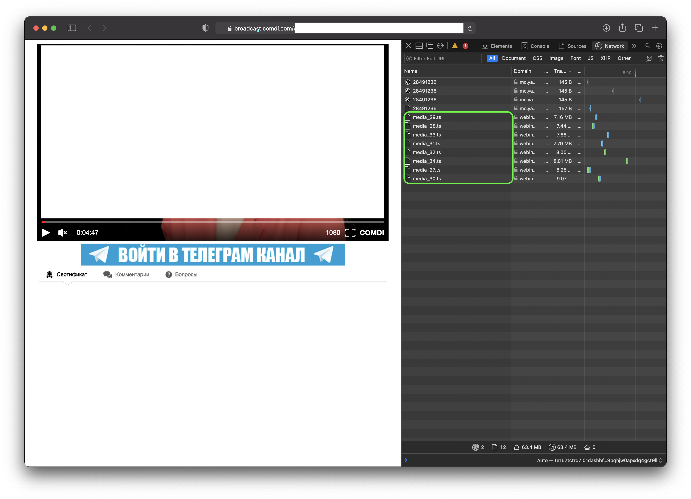
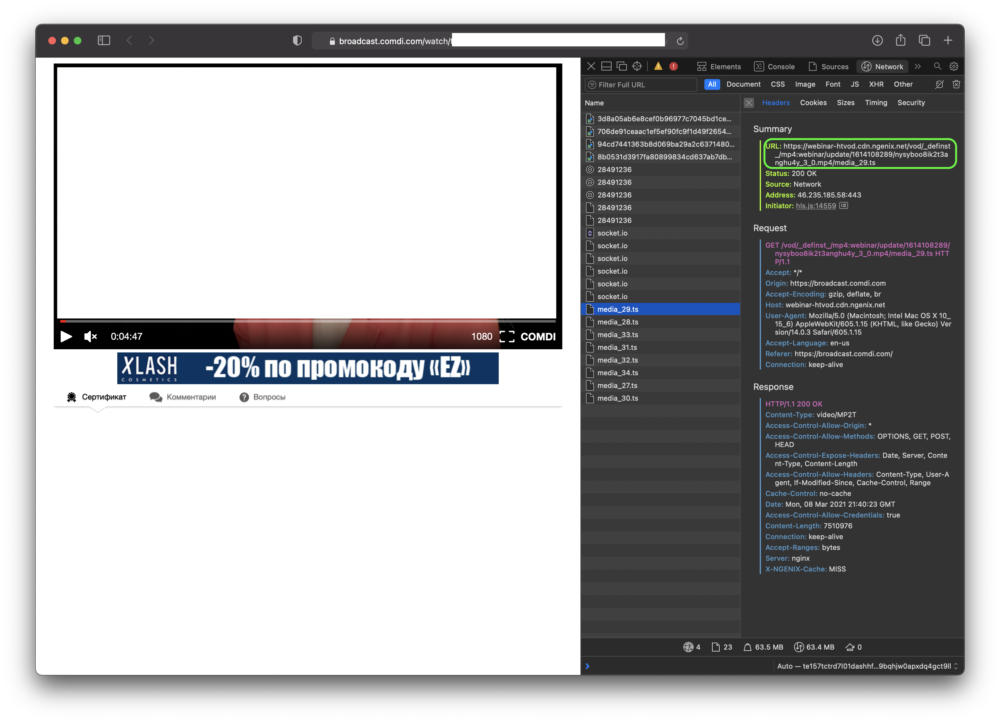
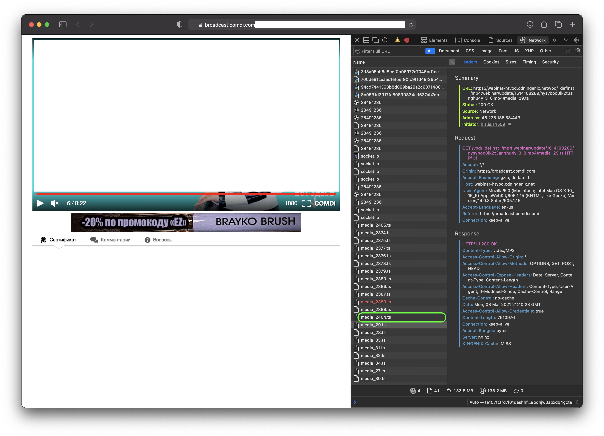
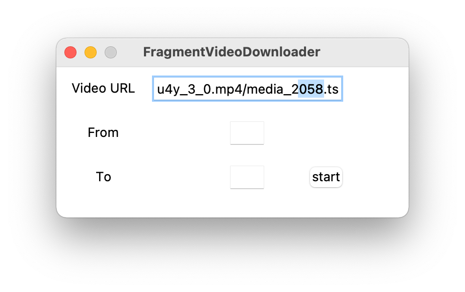
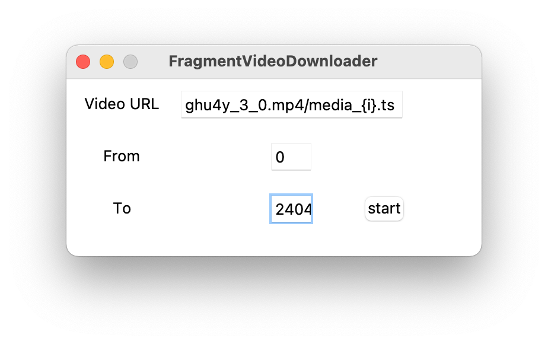
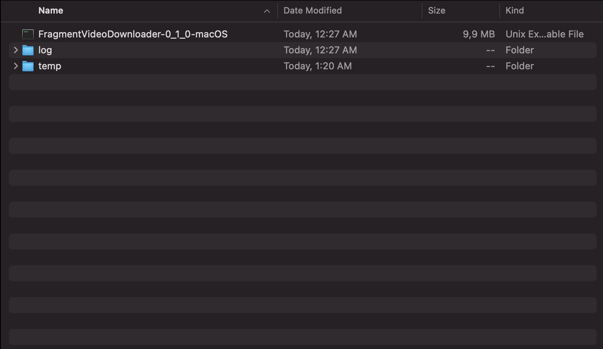
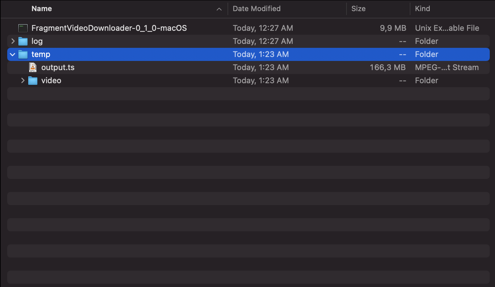

# FragmentVideoDownloader
Download and concatenate fragmented videos from any website with ease!

### Tired concatenating fragments of a video? This app will help you! 

## How to use
1. Go to a website where you want to download a video.
2. Open the web inspector (Safari and Chrome: COMMAND + OPTION + I or CTRL + ALT + I). Go to the Network tab

3. Find something that looks like that `media_*.ts`. File name can be different, but it should have numbers in it.
Click on one of the files.

4. Copy the url from of the file. 
   
5. Then determine what number refers to the first fragment of the video. In my case its `0`. 
The same thing goes for the last part. Run through the video to the end and find the last number. In may case it is `2404`

6. Open the app and paste the url you copied earlier.

7. Replace digits that unique for every fragment with `{i}`. Then enter the numbers that refers to the first part of the video 
and the last part. Should look like this:

   
8. Press `start` and watch for the directory when you opened the app.

The app generates two folders: the one for logs, and the other one for output file.

Your concatenated file is `temp/output.{YOUR_FILE_EXTENSION}`. The raw fragments placed at `temp/videos`

### No quality loss!
### Requires FFMPEG!

